# Tarea 3 de Interfaces Gráficas

Este proyecto es una aplicación de gestión de reservas en salones, donde los usuarios pueden crear, modificar y consultar reservas para diferentes tipos de eventos, como banquetes, jornadas y congresos. La interfaz gráfica está desarrollada con **PySide6**.

## Descripción

La aplicación permite gestionar reservas de eventos en salones, con soporte para distintos tipos de cocina y configuraciones de base de datos. Los usuarios pueden seleccionar las fechas, el tipo de cocina, el tipo de reserva y el salón para sus eventos.
## Requisitos

- **Python 3.11.0** 
- **PySide6**.
- **MySQL** o **SQLite** (según tu elección de base de datos).

## Instalación

1. Clona el repositorio:

   ```bash
   git clone https://github.com/tu_usuario/tarea3-interfaces.git
   ```
2. Navega al directorio del proyecto:

    ```bash
    cd ruta/repositorio
    ```
3. Instala las dependencias:
    ```bash
    pip install -r requirements.txt
    ```
4. Configura la base de datos

    En este paso, tienes varias opciones para configurar la base de datos de tu aplicación:
    
    - **Usar Docker para crear una base de datos MySQL:**  
      Si prefieres utilizar Docker, tenemos un archivo [`docker-compose.yml`](docker-compose.yml) que te permitirá crear una base de datos MySQL en el puerto 3307. Solo necesitas ejecutar el comando `docker-compose up` en la terminal.
    
      - **Crear una base de datos MySQL manualmente:**  
        Si prefieres no usar Docker, también puedes configurar una base de datos MySQL utilizando el script SQL [`setup_database_mysql.sql`](scrip-base-datos/setup_database_mysql.sql), que se encuentra en la carpeta `scrip-base-datos/`. Este script creará las tablas necesarias y configurará la base de datos.
    
      - **Crear una base de datos SQLite:**  
        Si prefieres usar SQLite, puedes configurar la base de datos con el archivo [`database_sqlite.sql`](scrip-base-datos/database_sqlite.sql), disponible también en la carpeta `scrip-base-datos/`. Este archivo creará una base de datos SQLite con la estructura necesaria.
    
    Una vez que hayas creado la base de datos, puedes configurar la conexión en el archivo [`bbdd.json`](file_configuracion/bbdd.json), ubicado en la carpeta `file_configuracion/`. Aunque puedes modificar este archivo manualmente en cualquier momento, se recomienda hacerlo durante el proceso de configuración de la aplicación, como se explica más adelante en la sección **"Uso y configuración de la aplicación"**.


## Uso y configuración de la aplicación

---

### 1. **Pantalla de Login**

<div align="center">
  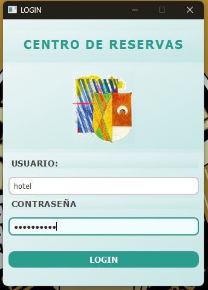
</div>

En esta pantalla inicial, debes ingresar tus credenciales (**usuario** y **contraseña**). Después de hacer clic en **Iniciar sesión**, el sistema validará las credenciales. Si son correctas, serás redirigido a la interfaz principal.

---

### 2. **Elección de la base de datos**

<div align="center">
  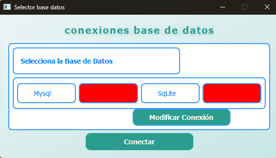
</div>

En esta pantalla, junto a los nombres de las bases de datos, aparecen etiquetas rojas que indican que la configuración actual no es válida. Haz clic en **Modificar conexión** para ajustar la configuración.

---

### 3. **Edición de la base de datos**

<div align="center">
  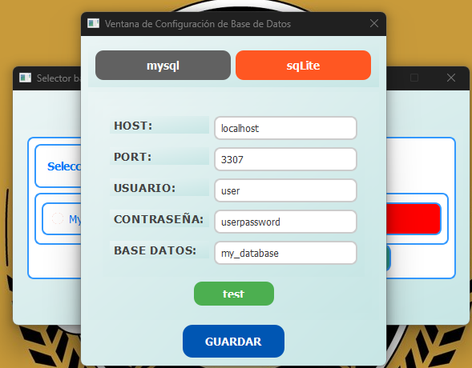
</div>

Puedes configurar las conexiones para **MySQL** y **SQLite**:
- En **MySQL**, introduce los datos necesarios para conectarte al servidor.
- En **SQLite**, selecciona el archivo `.sqlite` utilizando el selector.

Haz clic en **Test** para validar la conexión. Si es exitosa, podrás guardarla. Los valores por defecto están configurados para una base de datos creada con `docker-compose.yml`.

---

### 4. **Validación de la base de datos**

<div align="center">
  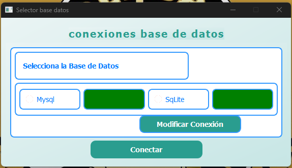
</div>

Cuando al menos una base de datos muestra una etiqueta verde, significa que está configurada correctamente. Selecciona el **radio button** correspondiente y realiza una validación adicional para comprobar las tablas necesarias.

<div align="center">
  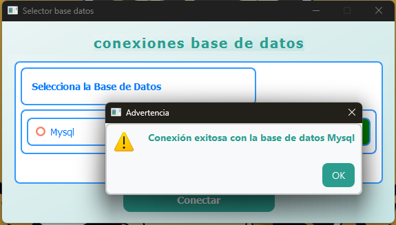
</div>

---

### 5. **La Aplicación**

<div align="center">
  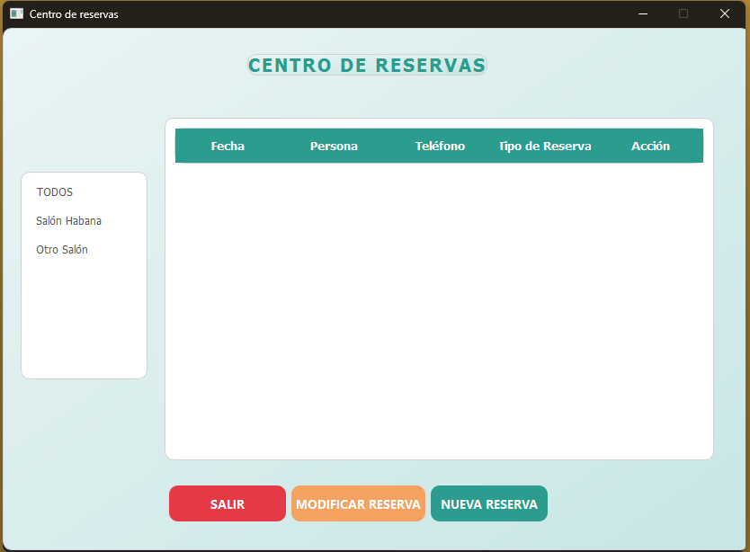
</div>

Al iniciar, la tabla está vacía. Usa el menú desplegable para filtrar por tipo de salón o mostrar todas las opciones.

---

### 6. **Creación de Reservas**

<div align="center">
  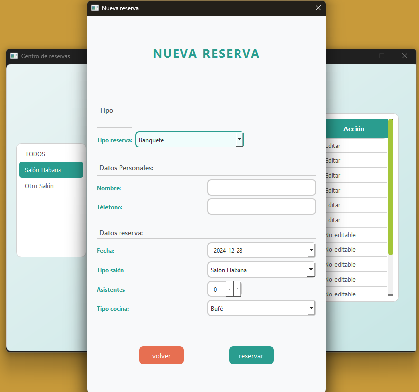
  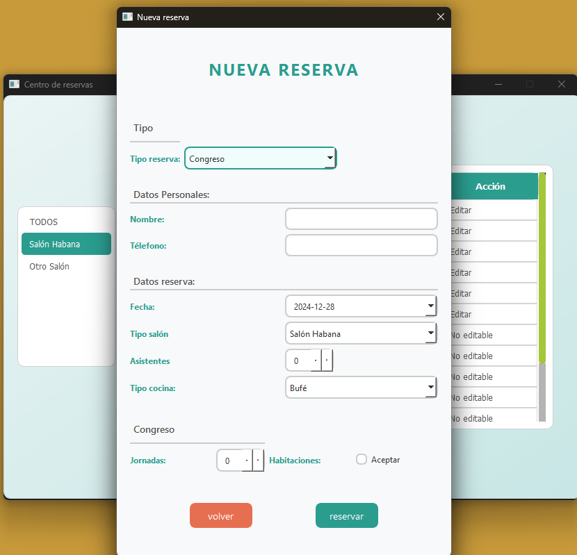
</div>

Haz clic en **Nueva Reserva** para configurar los detalles de una reserva. El calendario destaca las fechas ocupadas y evita seleccionar fechas inválidas.

<div align="center">
  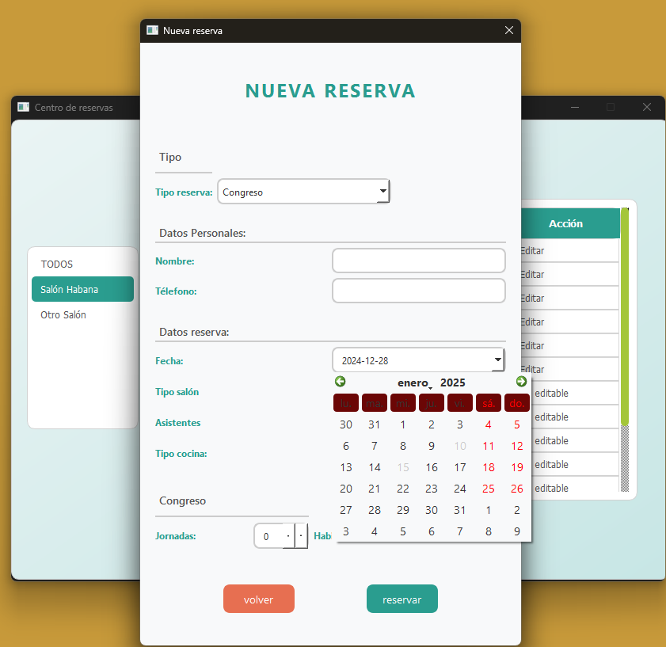
  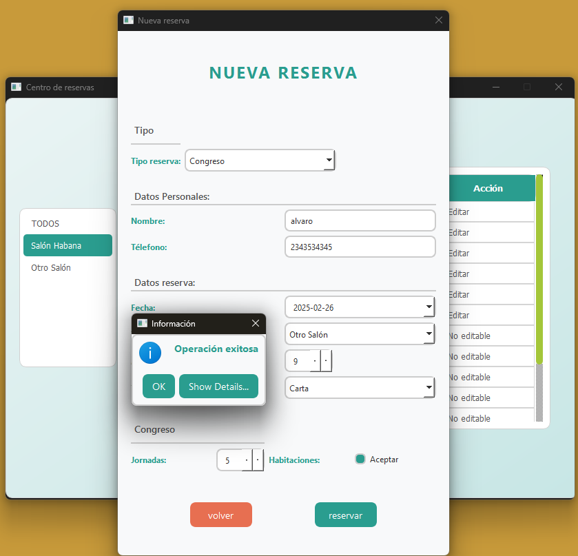
</div>

---

### 7. **Edición de Reservas**

<div align="center">
  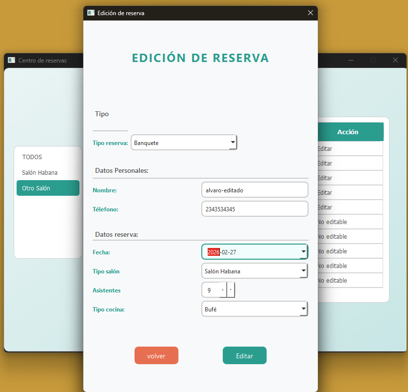
  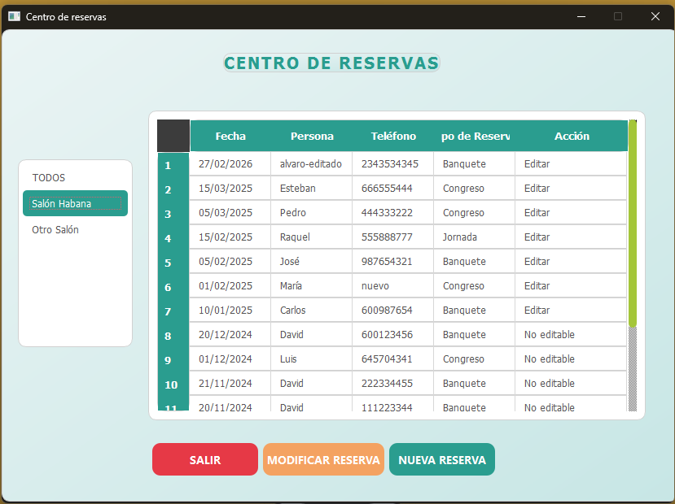
</div>

Selecciona una reserva en la tabla y haz clic en **Modificar** para abrir el panel de edición. Realiza los cambios necesarios y guarda los ajustes. Los datos se actualizarán automáticamente en la tabla.


---

## Aviso de Propiedad Intelectual

Este documento, junto con la aplicación descrita en él, constituye un trabajo desarrollado como parte de un proyecto académico del I.E.S. Brianda de Mendoza – Guadalajara, España. Todo el contenido, incluyendo el diseño, implementación y documentación, es propiedad intelectual de su autor, **Álvaro Bajo**.

Queda estrictamente prohibido reproducir, distribuir, modificar o utilizar este trabajo en cualquier forma sin el consentimiento explícito y por escrito del autor. 

Cualquier uso no autorizado será considerado una violación de los derechos de propiedad intelectual y estará sujeto a las acciones legales correspondientes.

Para consultas o solicitudes de uso, puedes contactar al autor a través de alvarobajo893@gmail.com.

---
